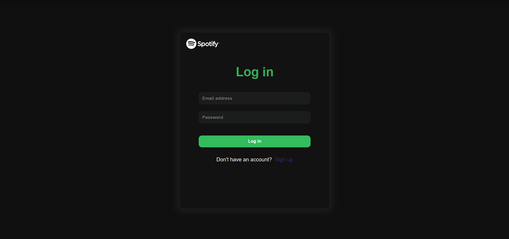
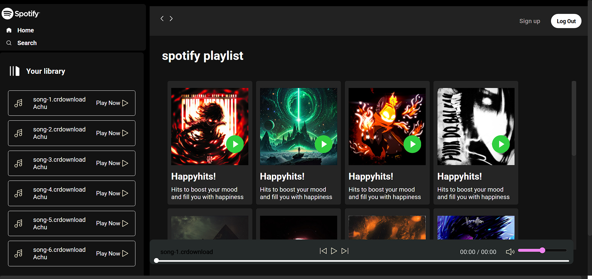
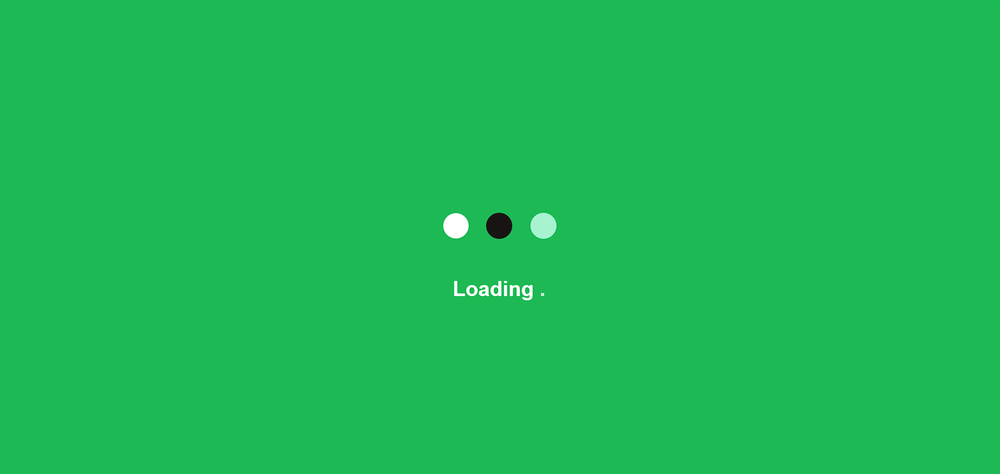
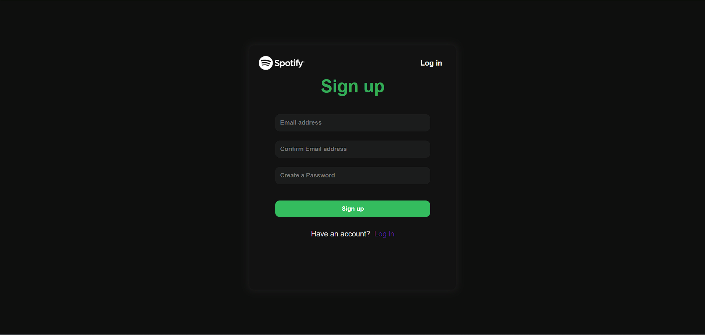

# Spotify-clone
This is an clone of the spotify app but it's little different from the main spotify i have added responsiveness and keep your song in folder and play it and it has loading animation with login page signup etc.  enjoy using this clone
# 🎵 Spotify Clone

A simple **Spotify Clone** built using **HTML, CSS, and JavaScript**.
It includes a login page with a loading screen, and a basic music player with play, pause, next, and previous functionality.

---

## 🚀 Features

* 🔑 Login page with email & password validation
* ⏳ Loading screen animation before showing main content
* 🎶 Music player with:
  * Play / Pause
  * Next / Previous track
  * Dynamic song info display
* 🎨 Responsive UI inspired by Spotify theme
* 📂 Organized folder structure for songs and images

---

## 📂 Project Structure

```
.
├── index.html          # Main Spotify Clone page
├── login.html          # Login page with loader
├── style.css           # Styles for the project
├── script.js           # JavaScript for player functionality
├── loading.css         # Styles for loading screen
├── images_used/        # Folder containing all images
│   ├── logo.png
│   ├── background.jpg
│   └── ...
└── songs/              # Folder containing audio files
    ├── song1.mp3
    ├── song2.mp3
    └── ...
```

---

## ⚡ How to Run

1. Clone the repository:

   ```bash
   git clone https://github.com/achu0722005/spotify-clone.git
   ```

2. Navigate to the project folder:

   ```bash
   cd spotify-clone
   ```

3. Open **`login.html`** in your browser.

4. Login using the credentials you set in the script (default: `akshayprocode@gmail.com / 12345`).

5. Enjoy your music! 🎧

---

## 🛠️ Tech Stack

* **HTML5**
* **CSS3**
* **JavaScript (Vanilla JS)**

---

## 📸 Screenshots

### 🔑 Login Page  
  

### 🎶 Dashboard  
  

### ⏳ Loading Animation  
  

### 🖼️ signup page  
  
 
```

---

## 📌 Future Improvements

* Add playlist functionality
* Volume control & seek bar
* Mobile optimization
* Backend authentication

---

## 👨‍💻 Author

Developed by Akshay N V ✨

---

